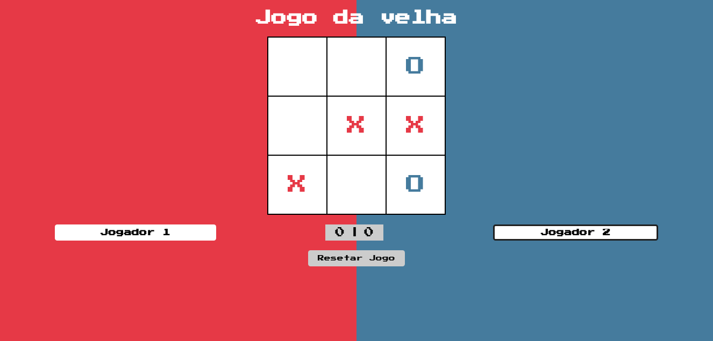

# Jogo da velha

Projeto de jogo da velha realizado durante o estágio na Vertigo Tecnologia com a finalidade de reforçar conhecimentos da linguagem Javascript.

Ele oferece funcionalidades como mudar nome dos jogadores, possibilidade de resetar o jogo e recomeça-lo quando o resultado é mostrado.

## Tecnologias

As seguintes tecnologias foram utilizadas na construção do projeto:

## Screen Shot

